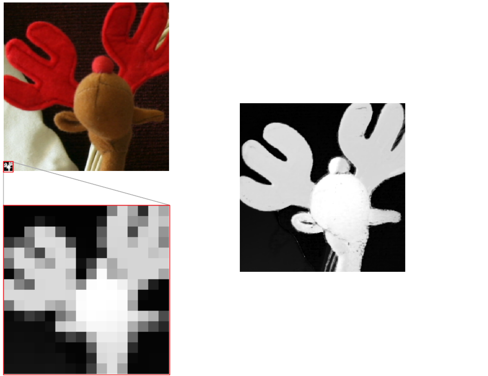

# PixTransform

PyTorch implementation of the algorithm presented in our [paper [1]](https://arxiv.org/abs/1904.01501). The algorithm can be used to perform guided super-resolution, for instance:

The function `PixTransform` takes as input two images, the source image of size M x M
and a guide image of size C x N x N, and returns an upsampled version of the source image with size
N x N. The upsampling factor D, equal to N/M, must be an integer.
    
    predicted_target = PixTransform(source,guide)
    
additional variables can be passed to change the default parameters. For further details about the algorithm see [[1]](https://arxiv.org/abs/1904.01501)

### Getting started

##### Installation
clone this git repository and make sure that the following packages are installed:
* numpy
* matplotlib
* scipy
* Pytorch
* ProxTV (optional)
* tqdm

##### Example script
To run the algorithm on some sample images check the Jupyter Notebook file [`process_examples.ipynb`](./process_examples.ipynb).

### Other methods

We compare the results of our algorithm with the results of the guided filter [2], the fast bilateral solver [3] [(authors' implementation)](https://github.com/poolio/bilateral_solver), the static-dynamic filter [4] [(authors' implementation)](https://github.com/bsham/SDFilter) and the multi-scale guided network [5] [(authors' implementation)](https://github.com/twhui/MSG-Net).

###### References

[[1] R. de Lutio, S. D'Aronco, J. D. Wegner, K. Schindler. "Guided Super-Resolution as a Learned Pixel-to-Pixel
Transformation", *arXiv*, 2019.](https://arxiv.org/abs/1904.01501)

[2] K. He, J. Sun, X. Tang. "Guided image filtering", *TPAMI*, 2013.

[3] J. T. Barron, B. Poole. "The fast bilateral solver", *ECCV*, 2016.

[4]  B. Ham, M. Cho, J. Ponce. "Robust guided image filtering using nonconvex potentials", *TPAMI*, 2018.

[5] T.-W. Hui, C. C. Loy, X. Tang. "Depth map super-resolution by deep multi-scale guidance", *ECCV*, 2016.
